# Greenland OBX slime 多节点运行流程（`_mns`）

当前 `greenland_cli_mns.py` + `examples/math_reasoning/run_qwen35_4b_base_mns.sh` 端到端运行流程。
示例配置：**6 节点拆分（disaggregated）= 2 training (16 GPU actor) + 4 rollout (32 GPU SGLang)**。

提交命令：
```bash
python3 greenland_cli_mns.py obx \
  --script examples/math_reasoning/run_qwen35_4b_base_mns.sh \
  --num-nodes 6 --rollout-nodes 4
```

```mermaid
flowchart TD
    Start([本地: python3 greenland_cli_mns.py obx<br/>--num-nodes 6 --rollout-nodes 4]) --> Val{校验<br/>rollout_nodes < num_nodes?}
    Val -->|否| Err1[报错退出]
    Val -->|是| Up{--no-upload?}

    subgraph LOCAL [本地提交机]
        Up -->|否, 默认| Sync[aws s3 sync 本地 slime → S3<br/>含修复后的 run 脚本]
        Up -->|是| Skip[用 S3 已有代码]
        Sync --> Boot
        Skip --> Boot
        Boot[渲染 bootstrap.sh<br/>把 rollout_nodes=4 写进 §5b] --> UpBoot[上传 bootstrap → S3<br/>_bootstrap/job-name.sh]
        UpBoot --> Loader[构造 tiny loader 命令 ≤8KB<br/>配凭证→下 bootstrap→exec]
        Loader --> Job[job_data: InstanceCount=6<br/>targetNodes 0:5, type multinode<br/>EFA 镜像 + infiniband 设备]
        Job --> API[提交 Greenland API]
    end

    API --> Sched[Greenland/AWS Batch 调度 6 个 P5EN 节点<br/>主节点先起, child 乱序起]

    Sched --> Each[每个节点跑同一个 loader → bootstrap]

    subgraph NODE [每个节点内 bootstrap §1-5]
        Each --> C1[§1 配 ECS 凭证 assume greenland-dev-role]
        C1 --> C2[§2 s3 sync 代码 → /root/slime]
        C2 --> C3[§3 下模型+数据 → NVMe]
        C3 --> C4[§4 后台 checkpoint sync 到 S3]
        C4 --> C5[§5 注入 env<br/>SKIP_SYS_LDPATH/SLIME_DIR/...]
    end

    C5 --> Fork{§5b 读 AWS_BATCH_JOB_NODE_INDEX<br/>NUM_NODES>1?}

    Fork -->|NUM_NODES=1| Single[单节点: 跳过整块<br/>直接跑 run 脚本 colocate]
    Fork -->|是, 多节点| IP[解析 SELF_IP eth0<br/>NCCL/GLOO_SOCKET_IFNAME=eth0]

    IP --> Role{NODE_INDEX == MAIN_INDEX?}

    Role -->|否, worker<br/>节点 1-5| W[ray start --address=MAIN_IP:6379<br/>--node-ip-address SELF_IP --block]
    W --> WBlock[阻塞驻留<br/>不跑 train.py<br/>主节点退出时被 Greenland 停掉]

    Role -->|是, 主节点<br/>node 0| M[export MASTER_ADDR=MAIN_IP]
    M --> MMode{ROLLOUT_NODES > 0?}
    MMode -->|是, 拆分| MD[ROLLOUT_NUM_GPUS=4×8=32<br/>ACTOR_NUM_NODES=6-4=2]
    MMode -->|否| MC[ACTOR_NUM_NODES=NUM_NODES<br/>colocate]
    MD --> Run
    MC --> Run

    Run[主节点: bash run_qwen35_4b_base_mns.sh] --> R1[按模式选显存参数<br/>拆分: max-tok 15360 / mem 0.85<br/>colocate: 9216 / 0.7]
    R1 --> R2[ray start --head]
    R2 --> R3[等待循环 已修<br/>ray.cluster_resources GPU<br/>直到 48 GPU 全注册]
    R3 --> R4{ROLLOUT_NUM_GPUS>0?}
    R4 -->|是| RArgs1[RESOURCE_ARGS:<br/>--actor-num-nodes 2<br/>--rollout-num-gpus 32<br/>无 --colocate]
    R4 -->|否| RArgs2[--actor-num-nodes N<br/>--colocate]
    RArgs1 --> Submit
    RArgs2 --> Submit
    Submit[ray job submit → python3 train.py]

    Submit --> Slime

    subgraph SLIME [slime train.py]
        Slime[create_placement_groups] --> PG{colocate?}
        PG -->|否, 拆分| PGd[总 PG = actor16 + rollout32 = 48<br/>按 node-IP 排序<br/>前16→actor, 尾32→rollout]
        PG -->|是| PGc[max actor,rollout, 时分复用]
        PGd --> Loop
        PGc --> Loop
        Loop[训练循环:<br/>rollout SGLang 生成 → 训练 actor<br/>→ 跨节点权重同步 走 EFA<br/>→ 存 checkpoint] --> Done([每 N 步 sync checkpoint → S3])
    end
```



## 关键节点说明

### 已验证（实测 6-node job `whx-run_qwen35_4b_base_mns-743432`，2026-06-18）
- **本地提交 → S3 → 6 节点调度**：跑通。
- **bootstrap §1-5 + §5b 节点分叉**：6 节点日志确认 SELF_IP 各异、都连同一 MAIN_IP、worker 全部 "Ray runtime started"。
- **拆分计算**：`main node (DISAGGREGATED): ACTOR_NUM_NODES=2 ROLLOUT_NUM_GPUS=32 (of 6 total nodes)`，显存参数 `MAX_TOKENS_PER_GPU=15360`/`SGLANG_MEM_FRACTION=0.85` 按模式选对。

### 待验证 / 刚修
- **R3 等待循环（已修）**：旧版 `ray status` 文本抓取在 `ray start --head` 刚起时遇到 "No cluster status..." → 卡在 `0/48`。已改为 `python3 -c "import ray; ray.init(address='auto'); print(int(ray.cluster_resources().get('GPU',0)))"` 直查 GCS。本地 + S3 都已更新，下次提交（默认 / `--no-upload`）都会用修复版。
- **EFA 跨节点 RDMA**：`NET/OFI` 日志只在 `ray job submit` 之后、actor/rollout NCCL 初始化时出现；上面的 wait-loop bug 把流程卡在 submit 之前，所以这次 run 没跑到。EFA 插件本身已在镜像里验证存在（SDB 实测 `NET/OFI Created device with 2 rails`）；真实跨节点 RDMA 要等修复版重投后在 actor 跨节点 all-reduce / 权重同步日志确认。

## 两个核心设计点
1. **同一份 bootstrap 跑在所有 6 个节点**，靠 `AWS_BATCH_JOB_NODE_INDEX` 分叉 —— 只有 node 0 跑 `train.py`，其余 5 个 `ray start --block` 当纯 worker（主节点退出时 Greenland 自动停 child）。
2. **拆分不靠人为指定哪个节点干啥** —— 所有节点组一个 Ray cluster，slime 按 node-IP 排序后前 16 GPU（2 节点）给 actor、尾 32 GPU（4 节点）给 rollout，天然按节点边界切（`slime/ray/placement_group.py` 非 colocate 取 `actor+rollout` 总数，`rollout_offset=actor_gpus`）。

## 模式对照
| 项 | colocate (`--rollout-nodes 0`) | disaggregated (`--rollout-nodes 4`) |
|---|---|---|
| 节点角色 | 全部 actor+rollout 时分复用 | 2 train + 4 rollout 各自独占 |
| train.py 资源参数 | `--colocate` | `--rollout-num-gpus 32`（无 `--colocate`）|
| `max-tokens-per-gpu` | 9216（共享显存，压激活峰值）| 15360（训练卡独占）|
| `sglang-mem-fraction-static` | 0.7（给训练权重留余量）| 0.85（推理卡独占，KV cache 更大）|
| offload | colocate 强制开 | slime 默认关（各侧常驻）|
| 跨节点通信 | 梯度 all-reduce | 梯度 all-reduce **+ actor→rollout 权重同步**（更吃 EFA）|
